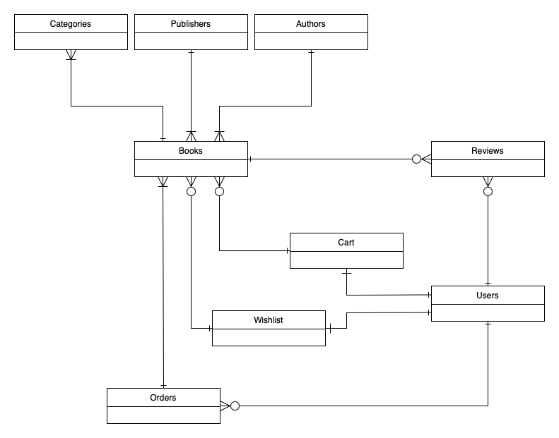

## Netbooks - E-commerce Next.js Website for Books

Welcome to Netbooks, a modern e-commerce platform built using Next.js. Netbooks is designed for book enthusiasts to browse, search, and purchase a wide selection of books. This project serves as a full-stack application with a sleek user interface, robust functionality, and scalable architecture.

## Features

- [] Book Listings: Display a wide variety of books with detailed descriptions.
- [] Search and Filters: Search for books by title, author, genre, or ISBN. Filter books by price, rating, and availability.
- [x] User Authentication: Secure login and signup for users to track their purchases and wishlists.
- [] Shopping Cart: Add books to the cart, view the total price, and proceed to checkout.
- [] Wishlist: Save books to a wishlist for future purchases.
- [] Reviews and Ratings: Allow users to rate and review books.
- [] Responsive Design: Optimized for both desktop and mobile users.
- [] Payment Gateway: Secure checkout with integrated payment options (Stripe).

## Tech Stack

- Framework: Next.js - React framework for building server-side rendered and static websites.
- Database: Convex Database - Full cloud backend
- Authentication: Clerk - User Management Platform
- API Routes: Custom Convex serverless functions for handling data, user authentication, and transactions.
- Payment Integration: Stripe integration for secure payments.
- Styling: Tailwind CSS, shadcn

## Database Schema

